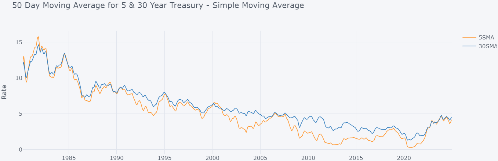
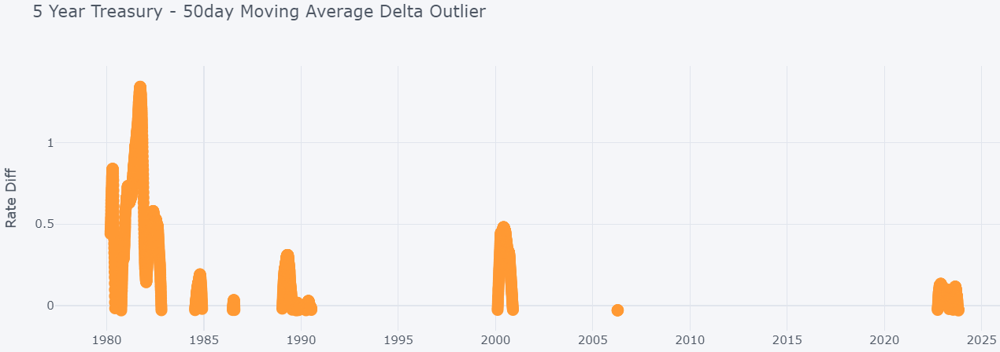

# Treasury Rates Simple Moving Average
## Introduction 
This an MVP python/pandas solution with data analytics. The goal is to evaluate specific US Treasury rates using a 50 day moving average for 5 and 30 year rates. I once read an article that stipulated when the 5 year 50 day moving average exceeds the 30 year day moving average, then this could be a predictor of a future recession.    
  
The solution uses python and Jupyter notebooks. I am using cufflinks to plot graphs to make the graphs are interactive.  

## Python Environment  
If you are using [conda](https://docs.anaconda.com/miniconda/install/) to create a python environment, then you may need to run **pip** install for plotly and cufflinks. At this writing **conda** does not support these libs.    
If using conda,
```
# Create python environment with conda 
conda create --name condapy1 python=3.12
conda activate condapy1
```
Install python libs
```
pip install pandas
pip install matplotlib
pip install plotly
pip install cufflink
```

## VSCODE setup  
I used [VSCODE](https://code.visualstudio.com/download) to run Jupyter notebooks (*.ipynb).  
This was a new vscode install. I already had a conda environment. 
- 1 From VSCODE install these extensions
    - python extension
    - Jupyter extension
- 2 Configure Python/conda in VSCODE settings
    - [see this link](https://geonetcast.wordpress.com/2023/01/17/using-conda-environments-with-visual-studio-code/)

## Usage 
There are 2 notebooks provided in this solution.  

| Notebook | Description | 
| -------- | ----------- | 
| 01_Load_Data.ipynb | Load, integrate, and save csv | 
| 02_Plot_data.ipynb | Load csv, manipulate and plot data |  
  
**Result**
  
  
  

## Data
Below are links to data source. I manually downloaded the data to csv files.   
- [2 Year](https://fred.stlouisfed.org/series/DGS2)  
- [5 Year](https://fred.stlouisfed.org/series/DGS5)  
- [10 Year](https://fred.stlouisfed.org/series/DGS10)  
- [20 Year](https://fred.stlouisfed.org/series/DGS20)  
- [30 Year](https://fred.stlouisfed.org/series/DGS30)  
  
## Graph Sources 
List of links to learn about plotly and cufflinks.  
- [Kaggle](https://www.kaggle.com/code/vvineeth/plotly-cufflinks-and-iplot)  
- [pitt.edu](https://sites.pitt.edu/~naraehan/presentation/Graphs_and_Plots_using_Plotly.html)
- [cufflinks Tutorial](https://github.com/santosjorge/cufflinks/blob/master/Cufflinks%20Tutorial%20-%20Plotly.ipynb)  
- [plotly time series](https://plotly.com/python/time-series/)  


### Credit 
Developer - Tim McCann  

### License
 
The MIT License (MIT)

Copyright (c) 2025 Tim McCann

Permission is hereby granted, free of charge, to any person obtaining a copy of this software and associated documentation files (the "Software"), to deal in the Software without restriction, including without limitation the rights to use, copy, modify, merge, publish, distribute, sublicense, and/or sell copies of the Software, and to permit persons to whom the Software is furnished to do so, subject to the following conditions:

The above copyright notice and this permission notice shall be included in all copies or substantial portions of the Software.

THE SOFTWARE IS PROVIDED "AS IS", WITHOUT WARRANTY OF ANY KIND, EXPRESS OR IMPLIED, INCLUDING BUT NOT LIMITED TO THE WARRANTIES OF MERCHANTABILITY, FITNESS FOR A PARTICULAR PURPOSE AND NONINFRINGEMENT. IN NO EVENT SHALL THE AUTHORS OR COPYRIGHT HOLDERS BE LIABLE FOR ANY CLAIM, DAMAGES OR OTHER LIABILITY, WHETHER IN AN ACTION OF CONTRACT, TORT OR OTHERWISE, ARISING FROM, OUT OF OR IN CONNECTION WITH THE SOFTWARE OR THE USE OR OTHER DEALINGS IN THE SOFTWARE.